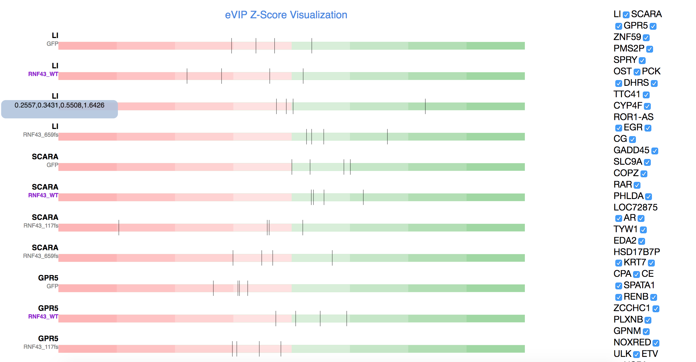

# bioVis_290A

Veronica Rivera, Mahika Dubey, Hadiseh Gooran

We worked with one of Angela Kim’s graduate students, Alexis Thornton, to create a visualization for her eVip data. This data consists of gene expression data and is currently used by Alexis as input into an unspecified additional piece of software to generate scores that are used to create an existing visualization that represents the average difference in gene expression between all genes. The eVip data consists of several gene ensemble IDs that represent different genes, along with 4 replicates for each gene: RNF 43_659fs (longer variant), RNF 43_117fs (shorter variant), RNF 43_WT (wild type version of the gene) and GFP (a control). 

We created a Python parser that takes in the eVip data (a txt file) and parses it into a JSON file which is then used to create the visualization.

Given this information, we set out to create a visualization based on a bullet chart. Our visualization design was inspired by Stephen Few’s bullet chart design and the implementation of Clint Ivy, Jamie Love and Jason Davies in D3. We wanted an efficient way for Alexis to be able to see and compare the z-scores across the four gene replications. Our initial design idea consisted of a list of ensemble IDs that could be checked on or off in order to display and hide the data. We created a “bullet” line that represents each gene replicate, where each line contains tick marks that correspond to the z-scores for that replicate. We also highlight the WT replicate, since that is the non-mutation gene replicate among the four and the one against which the other three gene replicates are compared. 

## Prerequisites

The application requires a Chrome Web browser. 

## Instructions
1. Download the program files and place them into a new folder. 
2. Open a terminal window and cd into the folder that contains the program files. 
3. Run "python -m SimpleHTTPServer".  
4. Open a new window in Chrome and navigate to http://localhost:8000. 
